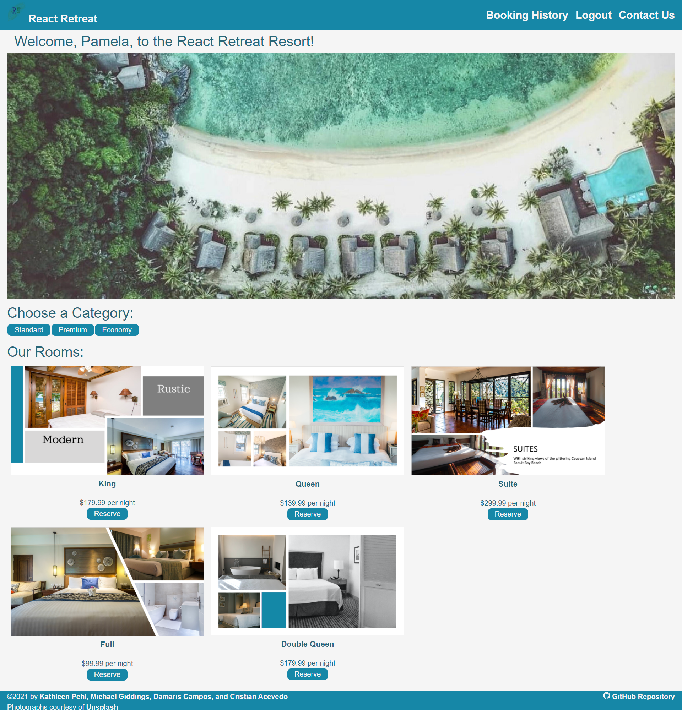
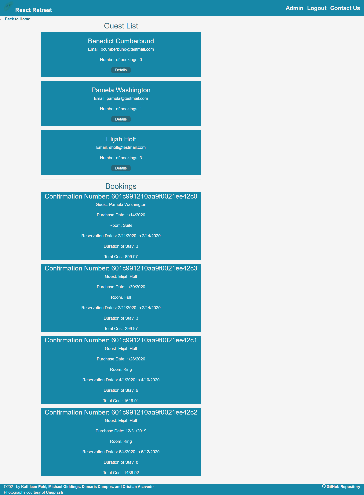
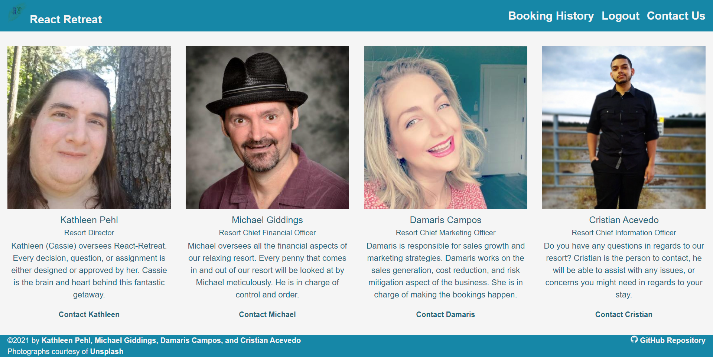
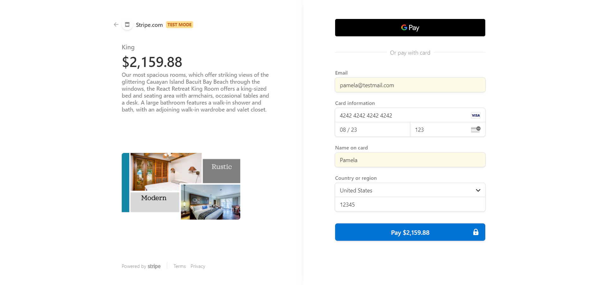

<h1 href= "https://github.com/kpehl/react-retreat" align= "center">React-Retreat</h1>
<h2>Live Link</h2>
<h3><a href= "https://react-retreat.herokuapp.com/">Live Link</a></h3>  
<h2> Table of Contents </h2>
<li><a href="#description">Description</a></li>  
<li><a href="#tech">Technology Stack</a></li>
<li><a href="#usage">Usage</a></li>
<li><a href="#screen">Screenshots</a></li>
<li><a href="#test">Test</a></li>
<li><a href="#contributors">Contributors / Contact</a></li>

<h2 id="description"> Description </h2>

This is our capstone project for the Trilogy Web Development Boot Camp. A fully functional progressive web application is built using the MERN stack (MongoDB, Express.js, React, Node.js). GraphQL is used for the query language. State management is performed with Redux. Authentication is performed with JSON Web Token.

<h2 id="tech"> Technology Stack</h2>
<li>MongoDB / Mongoose </li>
<li>Express.js</li>
<li>GraphQl</li>
<li>React</li>
<li>Redux</li>
<li>Node.js</li>
<li>JWT Authentication</li>
<li>ReactStrap</li>
<li>Create-React-App service worker</li>
<li>JavaScript ES5 and ES6</li>
<li>Heroku</li>
<li>Git</li>
</ul>          

<h2 id="usage"> Usage </h2>

Hotels need engaging and functional websites to attract potential guests and entice them to make a reservation and come to stay.  These websites must be both beautiful and easy to use.  The goal of our team was to create one of these websites for our class.  The React Retreat is a (fictional) luxury hotel that wants to be able to advertise to guests and allow them to make reservations using their website. Click on the Live Link above to see the website in action.

<h2 id="screen"> Screenshots </h2>

<h3 id="test"> Test </h3>

<h4> Desktop </h4>
<a>Hotel Main Page</a>

<a>Hotel Administrative Page</a>

<a>Hotel Contact Page</a>

<a>Hotel Checkout Page</a>

<h4> Link to Demo Video </h4>
<h5><a href= "https://drive.google.com/file/d/1pblEpQLujDUObZoGIKOkod1rsbJIUDGC/view">Demo</a></h5>

<h2 id="contributors"> Contributors/ Contact</h2>
<h4><a href= "https://github.com/kpehl">Kathleen Pehl</a></h4>

<h5><a href= "http://www.kathleen-pehl.net">Portfolio</a></h5>  
<h5><a href= "mailto:katheen.pehl@gmail.com">E-Mail</a></h5>       
<h5><a href= "https://www.linkedin.com/in/kathleen-pehl-77bb1710">LinkedIn</a></h5>

<h4><a href= "https://github.com/fondofhats">Michael Giddings</a></h4>
 
<h5><a href= "http://michaelgiddings.com/">Portfolio</a></h5>  
<h5><a href= "mailto:mikegiddings@gmail.com">E-Mail</a></h5>       
<h5><a href= "https://www.linkedin.com/in/michaelgiddings/">LinkedIn</a></h5>

<h4><a href= "https://github.com/DCampos07">Damaris Campos</a></h4>

<h5><a href= "https://DCampos07.github.io/">Portfolio</a></h5>  
<h5><a href= "mailto:dccampos00@gmail.comm">E-Mail</a></h5>       
<h5><a href= "https://www.linkedin.com/in/damaris-c-870a1472/">LinkedIn</a></h5>

<h4><a href= "https://github.com/cacevedo2011">Cristian Acevedo</a></h4>

<h5><a href= "https://cristianacevedoblog.wordpress.com/">Portfolio</a></h5>  
<h5><a href= "mailto:cristianacevedo2011@gmail.com">E-Mail</a></h5>       
<h5><a href= "https://www.linkedin.com/in/cristian-acevedo-21833692/">LinkedIn</a></h5>

